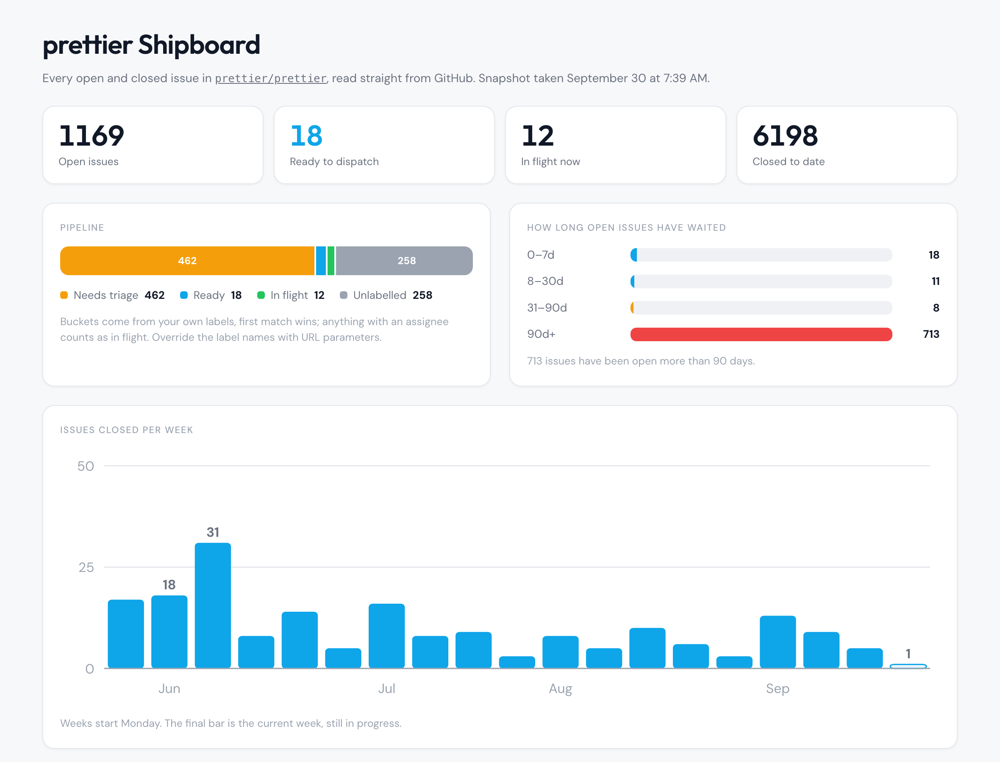

# Shipboard

A dashboard for GitHub issues: what's open, how long it's been waiting, how
much is closing each week, and what's ready to pick up next.

One static HTML file and one Node script. No dependencies, no build, no server
to run.

## Demo

[A live board for `prettier/prettier`](https://nch3ng.github.io/shipboard/?repo=prettier/prettier),
or the same thing as a picture:

<picture>
  <source media="(prefers-color-scheme: dark)" srcset="docs/demo-dark.png">
  
</picture>

## Quick start

Public repo, no install:

```
https://nch3ng.github.io/shipboard/?repo=tj/commander.js
```

Your own repo, including private ones:

```bash
git clone https://github.com/nch3ng/shipboard
cd shipboard
node shipboard.js owner/name --serve
```

Node 18 or later. Nothing to install.

## Three ways to run it

**Generate a file.** Fetches the issues and writes a self-contained HTML file.
Works on private repos. Opens without a network connection.

```bash
node shipboard.js owner/name -o board.html
```

**Serve it locally.** The same board, re-fetched on a timer, on
`http://localhost:8080`. Use this for private repos.

```bash
node shipboard.js owner/name --serve
```

**Host `index.html`.** The page fetches the GitHub API from the browser, so
there's no CLI and no server. This is the version you can embed. Public repos
only. Use the hosted copy above, or put `index.html` anywhere that serves
static files:

```
https://YOUR-USERNAME.github.io/shipboard/?repo=owner/name
```

With no `?repo=`, the page shows a form.

## Private repos

The CLI looks for credentials in this order:

1. `GITHUB_TOKEN`
2. `GH_TOKEN`
3. `gh auth token`, so being logged in with `gh auth login` is enough

The token stays on your machine and never ends up in the output file.

You can't publicly embed a live board for a private repo, because that would
mean giving every viewer a token. Generate a file on a schedule and put it
somewhere access-controlled:

```bash
node shipboard.js owner/private-repo -o board.html
```

That file contains issue numbers, titles, and labels, so treat it as you would
the repo itself.

## Embedding

```html
<iframe src="https://YOUR-USERNAME.github.io/shipboard/?repo=owner/name"
        title="Shipboard" style="width:100%;height:1600px;border:0" loading="lazy"></iframe>
```

To avoid guessing the height, the page posts its own:

```js
addEventListener('message', (e) => {
  if (e.data?.shipboard === 'height') frame.style.height = e.data.height + 'px';
});
```

Generated files embed the same way. They're ordinary HTML.

## Self-hosting

Fork the repo, then Settings → Pages → deploy from `main`, root. There's no
build step. Any static host works, and opening `index.html` from disk works
too.

## Configuring buckets

Each open issue goes in exactly one bucket. First match wins:

In flight (assigned, or a flight label) → Blocked → Ready → Later → Unlabelled
(no labels at all) → Needs triage (everything else).

Each bucket is a comma-separated list of label names. Override them per repo in
the URL:

| Parameter | Default |
|---|---|
| `flight` | `in progress,in-progress,wip,claimed,agent-claimed` |
| `blocked` | `blocked,on hold` |
| `ready` | `ready,agent-ready,good first issue,help wanted` |
| `later` | `later,backlog,icebox,wontfix` |
| `triage` | `triage,needs triage,needs-triage,agent-proposed` |

```
?repo=owner/name&ready=approved,scoped&flight=doing
```

The priority, bug, and security badges come from label names, plus the title
for priority: `P0`, `[HIGH]`, `critical`, `bug`, `security`.

## Options

```
node shipboard.js owner/name [-o out.html] [--serve] [--port 8080] [--refresh 600]
```

`--refresh` sets the server's re-fetch interval in seconds. Adding `?refresh`
to the URL forces one.

## Limits

* **The four headline counts are exact.** They come from the search API, so
  they are right even for a repo with 10,000 issues.
* **The panels below them read up to 1000 open issues**, most recently created
  first. Past that the footer says so. Raise `MAX_PAGES` in both files to go
  further.
* **Closed issues are fetched for the chart window only**, currently 19 weeks.
* **API rate limits.** 60 requests per hour without a token, 5000 with one. A
  board costs one request per 100 open issues plus two or three searches. The
  browser version caches for 10 minutes.
* **Labels, not categories.** The "where the open work sits" panel shows your
  six most-used labels. Nothing is inferred from issue text.

## Tests

Two checks, no framework and nothing to install:

```bash
open 'index.html?selftest=1'    # bucketing, ageing, week binning, counts
node shipboard.js --selftest    # HTML templating, which has to survive
                                # $& and </script> inside issue titles
```

## License

MIT
